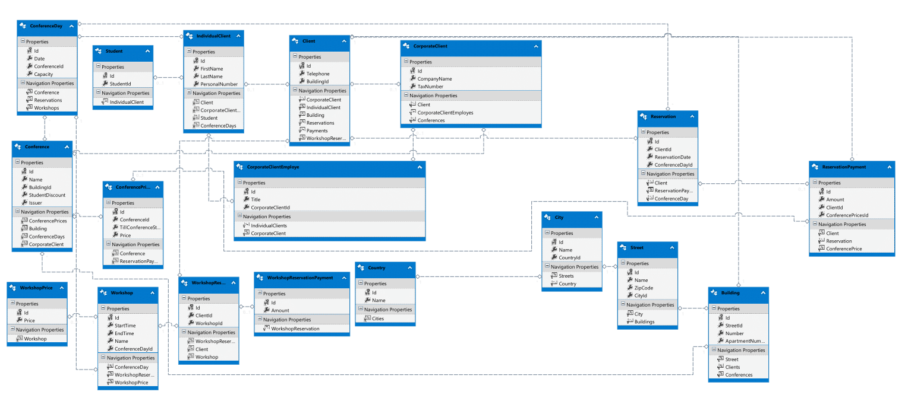

# Podstawy Baz Danych laboratoria - sprawozdanie z projektu

------

##### AGH IET 2019 - Mateusz Popielarz, Michał Flak


## Opis funkcjonalności bazy

Baza danych obsługuje firmę organizującą konferencje.

Klientami mogą być zarówno indywidualne osoby jak i firmy. Osoby mogą zapisać się na poszczególne dni konferencji, opłata jest jednak za całość.

W ramach konferencji organizowane są warsztaty. Osoba może zapisać się na warsztat trwający podczas konferencji na którą jest zapisany, ale nie może na dwa warsztaty które pokrywają się czasowo.

Wysokość opłaty jest zmienna w zależności od terminu płatności. Istnieje procedura służąca do usuwania rezerwacji nieopłaconych do tygodnia przed rozpoczęciem konferencji, jednak MSSQL w wersji Express oraz tej udostępnionej przez AGH nie umożliwia zaplanowanego uruchamiania jej w określonym czasie. Studenci mają możliwość otrzymania zniżki.

Firma ma dostęp do raportów pokazujących listę stałych klientów, oraz uczestników konferencji i warsztatów w poszczególny dzień.

Stworzony jest również generator danych symulujący 3-letnią działalność firmy.


## Użytkownicy i role

- ### customerservice

  Osoba obsługująca klientów indywidualnych i korporacyjnych. Zajmuje się zapisywaniem uczestników na konferencje i warsztaty, oraz obsługuje płatności.

  ```mssql
  CREATE ROLE [customerservice]
  GRANT SELECT ON GetAttendantsAtConferenceDay TO customerservice
  GRANT SELECT ON GetAttendantsAtWorkshopsOnConferenceDay TO customerservice
  GRANT SELECT ON GetConferenceStart TO customerservice
  GRANT SELECT ON GetIndividualClientOrThrow TO customerservice
  GRANT SELECT ON GetConferenceWithPriceAccordingToDate TO customerservice
  GRANT SELECT ON LoyalClientsView TO customerservice
  GRANT EXECUTE ON AddAddress TO customerservice
  GRANT EXECUTE ON AddClient TO customerservice
  GRANT EXECUTE ON AddCorporateClient TO customerservice
  GRANT EXECUTE ON AddStudent TO customerservice
  GRANT EXECUTE ON AssignEmployerToEmployee TO customerservice
  GRANT EXECUTE ON MakeReservation TO customerservice
  GRANT EXECUTE ON MakeReservationCorporation TO customerservice
  GRANT EXECUTE ON PayForReservationWithADate TO customerservice
  GRANT EXECUTE ON DeleteUnpaidReservations TO customerservice
  GRANT EXECUTE ON ReserveAPlaceForAWorkshop TO customerservice
  ```

  

- ### organizer

  Tworzy konferencje oraz warsztaty, nadaje im ceny za uczestnictwo.

```mssql
  CREATE ROLE [organizer]
  GRANT SELECT ON GetAttendantsAtConferenceDay TO customerservice
  GRANT SELECT ON GetAttendantsAtWorkshopsOnConferenceDay TO customerservice
  GRANT SELECT ON GetConferenceStart TO customerservice
  GRANT SELECT ON LoyalClientsView TO customerservice
  GRANT EXECUTE ON DeleteUnpaidReservations TO customerservice
  GRANT EXECUTE ON AddPriceToConference TO customerservice
  GRANT EXECUTE ON AddConference TO customerservice
  GRANT EXECUTE ON AddConferenceDay TO customerservice
  GRANT EXECUTE ON AddWorkshop TO customerservice
  GRANT EXECUTE ON AddPriceToWorkshop TO customerservice
```

  

## Schemat bazy danych

- ### Schemat UML

  

- ### Definicje tabel

  ```mssql
  -- Creating table 'Clients'
  CREATE TABLE [dbo].[Clients] (
      [Id] int IDENTITY(1,1) NOT NULL,
      [Telephone] nvarchar(max)  NOT NULL,
      [BuildingId] int  NOT NULL
  );
  GO
  
  -- Creating table 'CorporateClients'
  CREATE TABLE [dbo].[CorporateClients] (
      [Id] int  NOT NULL,
      [CompanyName] nvarchar(120)  NOT NULL,
      [TaxNumber] nvarchar(30)  NOT NULL
  );
  GO
  
  -- Creating table 'IndividualClients'
  CREATE TABLE [dbo].[IndividualClients] (
      [Id] int  NOT NULL,
      [FirstName] nvarchar(max)  NOT NULL,
      [LastName] nvarchar(max)  NOT NULL,
      [PersonalNumber] nchar(11)  NOT NULL
  );
  GO
  
  -- Creating table 'CorporateClientEmployes'
  CREATE TABLE [dbo].[CorporateClientEmployes] (
      [Id] int  NOT NULL,
      [Title] nvarchar(max)  NOT NULL,
      [CorporateClientId] int  NULL
  );
  GO
  
  -- Creating table 'Workshops'
  CREATE TABLE [dbo].[Workshops] (
      [Id] int IDENTITY(1,1) NOT NULL,
      [StartTime] datetime  NOT NULL,
      [EndTime] datetime  NOT NULL,
      [Name] nvarchar(max)  NOT NULL,
      [ConferenceDayId] int  NOT NULL
  );
  GO
  
  -- Creating table 'WorkshopPrices'
  CREATE TABLE [dbo].[WorkshopPrices] (
      [Id] int  NOT NULL,
      [Price] decimal(18,0)  NOT NULL
  );
  GO
  
  -- Creating table 'Conferences'
  CREATE TABLE [dbo].[Conferences] (
      [Id] int IDENTITY(1,1) NOT NULL,
      [Name] nvarchar(max)  NOT NULL,
      [BuildingId] int  NOT NULL,
      [StudentDiscount] tinyint  NOT NULL,
      [Issuer] int  NOT NULL
  );
  GO
  
  -- Creating table 'ConferencePrices'
  CREATE TABLE [dbo].[ConferencePrices] (
      [Id] int IDENTITY(1,1) NOT NULL,
      [ConferenceId] int  NOT NULL,
      [TillConferenceStart] smallint  NOT NULL,
      [Price] decimal(18,0)  NOT NULL
  );
  GO
  
  -- Creating table 'Students'
  CREATE TABLE [dbo].[Students] (
      [Id] int  NOT NULL,
      [StudentId] nvarchar(120)  NOT NULL
  );
  GO
  
  -- Creating table 'Cities'
  CREATE TABLE [dbo].[Cities] (
      [Id] int IDENTITY(1,1) NOT NULL,
      [Name] nvarchar(80)  NOT NULL,
      [CountryId] int  NOT NULL
  );
  GO
  
  -- Creating table 'Streets'
  CREATE TABLE [dbo].[Streets] (
      [Id] int IDENTITY(1,1) NOT NULL,
      [Name] nvarchar(50)  NOT NULL,
      [ZipCode] nvarchar(20)  NOT NULL,
      [CityId] int  NOT NULL
  );
  GO
  
  -- Creating table 'Buildings'
  CREATE TABLE [dbo].[Buildings] (
      [Id] int IDENTITY(1,1) NOT NULL,
      [StreetId] int  NOT NULL,
      [Number] nvarchar(20)  NOT NULL,
      [ApartmentNumber] int  NULL
  );
  GO
  
  -- Creating table 'Countries'
  CREATE TABLE [dbo].[Countries] (
      [Id] int IDENTITY(1,1) NOT NULL,
      [Name] nvarchar(50)  NOT NULL
  );
  GO
  
  -- Creating table 'Reservations'
  CREATE TABLE [dbo].[Reservations] (
      [Id] int IDENTITY(1,1) NOT NULL,
      [ClientId] int  NOT NULL,
      [ReservationDate] datetime  NOT NULL,
      [ConferenceDayId] int  NOT NULL
  );
  GO
  
  -- Creating table 'ConferenceDays'
  CREATE TABLE [dbo].[ConferenceDays] (
      [Id] int IDENTITY(1,1) NOT NULL,
      [Date] datetime  NOT NULL,
      [ConferenceId] int  NOT NULL,
      [Capacity] int  NOT NULL
  );
  GO
  
  -- Creating table 'WorkshopReservations'
  CREATE TABLE [dbo].[WorkshopReservations] (
      [Id] int IDENTITY(1,1) NOT NULL,
      [ClientId] int  NOT NULL,
      [WorkshopId] int  NOT NULL
  );
  GO
  
  -- Creating table 'ReservationPayments'
  CREATE TABLE [dbo].[ReservationPayments] (
      [Id] int  NOT NULL,
      [Amount] decimal(18,0)  NOT NULL,
      [ClientId] int  NOT NULL,
      [ConferencePricesId] int  NULL
  );
  GO
  
  -- Creating table 'WorkshopReservationPayments'
  CREATE TABLE [dbo].[WorkshopReservationPayments] (
      [Id] int  NOT NULL,
      [Amount] decimal(18,0)  NOT NULL
  );
  GO
  
  -- Creating table 'IndividualClientConferenceDay'
  CREATE TABLE [dbo].[IndividualClientConferenceDay] (
      [IndividualClientConferenceDay_ConferenceDay_Id] int  NOT NULL,
      [ConferenceDays_Id] int  NOT NULL
  );
  GO
  ```

- ### Warunki intregralnościowe - klucze

  ```mssql
  -- --------------------------------------------------
  -- Creating all PRIMARY KEY constraints
  -- --------------------------------------------------
  
  -- Creating primary key on [Id] in table 'Clients'
  ALTER TABLE [dbo].[Clients]
  ADD CONSTRAINT [PK_Clients]
      PRIMARY KEY CLUSTERED ([Id] ASC);
  GO
  
  -- Creating primary key on [Id] in table 'CorporateClients'
  ALTER TABLE [dbo].[CorporateClients]
  ADD CONSTRAINT [PK_CorporateClients]
      PRIMARY KEY CLUSTERED ([Id] ASC);
  GO
  
  -- Creating primary key on [Id] in table 'IndividualClients'
  ALTER TABLE [dbo].[IndividualClients]
  ADD CONSTRAINT [PK_IndividualClients]
      PRIMARY KEY CLUSTERED ([Id] ASC);
  GO
  
  -- Creating primary key on [Id] in table 'CorporateClientEmployes'
  ALTER TABLE [dbo].[CorporateClientEmployes]
  ADD CONSTRAINT [PK_CorporateClientEmployes]
      PRIMARY KEY CLUSTERED ([Id] ASC);
  GO
  
  -- Creating primary key on [Id] in table 'Workshops'
  ALTER TABLE [dbo].[Workshops]
  ADD CONSTRAINT [PK_Workshops]
      PRIMARY KEY CLUSTERED ([Id] ASC);
  GO
  
  -- Creating primary key on [Id] in table 'WorkshopPrices'
  ALTER TABLE [dbo].[WorkshopPrices]
  ADD CONSTRAINT [PK_WorkshopPrices]
      PRIMARY KEY CLUSTERED ([Id] ASC);
  GO
  
  -- Creating primary key on [Id] in table 'Conferences'
  ALTER TABLE [dbo].[Conferences]
  ADD CONSTRAINT [PK_Conferences]
      PRIMARY KEY CLUSTERED ([Id] ASC);
  GO
  
  -- Creating primary key on [Id] in table 'ConferencePrices'
  ALTER TABLE [dbo].[ConferencePrices]
  ADD CONSTRAINT [PK_ConferencePrices]
      PRIMARY KEY CLUSTERED ([Id] ASC);
  GO
  
  -- Creating primary key on [Id] in table 'Students'
  ALTER TABLE [dbo].[Students]
  ADD CONSTRAINT [PK_Students]
      PRIMARY KEY CLUSTERED ([Id] ASC);
  GO
  
  -- Creating primary key on [Id] in table 'Cities'
  ALTER TABLE [dbo].[Cities]
  ADD CONSTRAINT [PK_Cities]
      PRIMARY KEY CLUSTERED ([Id] ASC);
  GO
  
  -- Creating primary key on [Id] in table 'Streets'
  ALTER TABLE [dbo].[Streets]
  ADD CONSTRAINT [PK_Streets]
      PRIMARY KEY CLUSTERED ([Id] ASC);
  GO
  
  -- Creating primary key on [Id] in table 'Buildings'
  ALTER TABLE [dbo].[Buildings]
  ADD CONSTRAINT [PK_Buildings]
      PRIMARY KEY CLUSTERED ([Id] ASC);
  GO
  
  -- Creating primary key on [Id] in table 'Countries'
  ALTER TABLE [dbo].[Countries]
  ADD CONSTRAINT [PK_Countries]
      PRIMARY KEY CLUSTERED ([Id] ASC);
  GO
  
  -- Creating primary key on [Id] in table 'Reservations'
  ALTER TABLE [dbo].[Reservations]
  ADD CONSTRAINT [PK_Reservations]
      PRIMARY KEY CLUSTERED ([Id] ASC);
  GO
  
  -- Creating primary key on [Id] in table 'ConferenceDays'
  ALTER TABLE [dbo].[ConferenceDays]
  ADD CONSTRAINT [PK_ConferenceDays]
      PRIMARY KEY CLUSTERED ([Id] ASC);
  GO
  
  -- Creating primary key on [Id] in table 'WorkshopReservations'
  ALTER TABLE [dbo].[WorkshopReservations]
  ADD CONSTRAINT [PK_WorkshopReservations]
      PRIMARY KEY CLUSTERED ([Id] ASC);
  GO
  
  -- Creating primary key on [Id] in table 'ReservationPayments'
  ALTER TABLE [dbo].[ReservationPayments]
  ADD CONSTRAINT [PK_ReservationPayments]
      PRIMARY KEY CLUSTERED ([Id] ASC);
  GO
  
  -- Creating primary key on [Id] in table 'WorkshopReservationPayments'
  ALTER TABLE [dbo].[WorkshopReservationPayments]
  ADD CONSTRAINT [PK_WorkshopReservationPayments]
      PRIMARY KEY CLUSTERED ([Id] ASC);
  GO
  
  -- Creating primary key on [IndividualClientConferenceDay_ConferenceDay_Id], [ConferenceDays_Id] in table 'IndividualClientConferenceDay'
  ALTER TABLE [dbo].[IndividualClientConferenceDay]
  ADD CONSTRAINT [PK_IndividualClientConferenceDay]
      PRIMARY KEY CLUSTERED ([IndividualClientConferenceDay_ConferenceDay_Id], [ConferenceDays_Id] ASC);
  GO
  
  -- --------------------------------------------------
  -- Creating all FOREIGN KEY constraints
  -- --------------------------------------------------
  
  -- Creating foreign key on [Id] in table 'CorporateClients'
  ALTER TABLE [dbo].[CorporateClients]
  ADD CONSTRAINT [FK_Client_CorporateClient]
      FOREIGN KEY ([Id])
      REFERENCES [dbo].[Clients]
          ([Id])
      ON DELETE NO ACTION ON UPDATE NO ACTION;
  GO
  
  -- Creating foreign key on [Id] in table 'IndividualClients'
  ALTER TABLE [dbo].[IndividualClients]
  ADD CONSTRAINT [FK_Client_IndividualClient]
      FOREIGN KEY ([Id])
      REFERENCES [dbo].[Clients]
          ([Id])
      ON DELETE NO ACTION ON UPDATE NO ACTION;
  GO
  
  -- Creating foreign key on [Id] in table 'CorporateClientEmployes'
  ALTER TABLE [dbo].[CorporateClientEmployes]
  ADD CONSTRAINT [FK_CorporateClientEmployeIndividualClient]
      FOREIGN KEY ([Id])
      REFERENCES [dbo].[IndividualClients]
          ([Id])
      ON DELETE NO ACTION ON UPDATE NO ACTION;
  GO
  
  -- Creating foreign key on [CorporateClientId] in table 'CorporateClientEmployes'
  ALTER TABLE [dbo].[CorporateClientEmployes]
  ADD CONSTRAINT [FK_CorporateClientCorporateClientEmploye]
      FOREIGN KEY ([CorporateClientId])
      REFERENCES [dbo].[CorporateClients]
          ([Id])
      ON DELETE NO ACTION ON UPDATE NO ACTION;
  GO
  
  -- Creating foreign key on [ConferenceId] in table 'ConferencePrices'
  ALTER TABLE [dbo].[ConferencePrices]
  ADD CONSTRAINT [FK_ConferenceConferencePrices]
      FOREIGN KEY ([ConferenceId])
      REFERENCES [dbo].[Conferences]
          ([Id])
      ON DELETE NO ACTION ON UPDATE NO ACTION;
  GO
  
  -- Creating foreign key on [Id] in table 'Students'
  ALTER TABLE [dbo].[Students]
  ADD CONSTRAINT [FK_StudentIndividualClient]
      FOREIGN KEY ([Id])
      REFERENCES [dbo].[IndividualClients]
          ([Id])
      ON DELETE NO ACTION ON UPDATE NO ACTION;
  GO
  
  -- Creating foreign key on [CityId] in table 'Streets'
  ALTER TABLE [dbo].[Streets]
  ADD CONSTRAINT [FK_CityStreet]
      FOREIGN KEY ([CityId])
      REFERENCES [dbo].[Cities]
          ([Id])
      ON DELETE NO ACTION ON UPDATE NO ACTION;
  GO
  
  -- Creating foreign key on [StreetId] in table 'Buildings'
  ALTER TABLE [dbo].[Buildings]
  ADD CONSTRAINT [FK_StreetBuilding]
      FOREIGN KEY ([StreetId])
      REFERENCES [dbo].[Streets]
          ([Id])
      ON DELETE NO ACTION ON UPDATE NO ACTION;
  GO
  
  -- Creating foreign key on [BuildingId] in table 'Clients'
  ALTER TABLE [dbo].[Clients]
  ADD CONSTRAINT [FK_ClientBuilding]
      FOREIGN KEY ([BuildingId])
      REFERENCES [dbo].[Buildings]
          ([Id])
      ON DEL
  
  -- Creating foreign key on [BuildingId] in table 'Conferences'
  ALTER TABLE [dbo].[Conferences]
  ADD CONSTRAINT [FK_ConferenceBuilding]
      FOREIGN KEY ([BuildingId])
      REFERENCES [dbo].[Buildings]
          ([Id])
      ON DELETE NO ACTION ON UPDATE NO ACTION;
  GO
  
  -- Creating foreign key on [ConferenceId] in table 'ConferenceDays'
  ALTER TABLE [dbo].[ConferenceDays]
  ADD CONSTRAINT [FK_ConferenceDayConference]
      FOREIGN KEY ([ConferenceId])
      REFERENCES [dbo].[Conferences]
          ([Id])
      ON DELETE NO ACTION ON UPDATE NO ACTION;
  GO
  
  -- Creating foreign key on [ClientId] in table 'Reservations'
  ALTER TABLE [dbo].[Reservations]
  ADD CONSTRAINT [FK_ReservationClient]
      FOREIGN KEY ([ClientId])
      REFERENCES [dbo].[Clients]
          ([Id])
      ON DELETE NO ACTION ON UPDATE NO ACTION;
  GO
  
  -- Creating foreign key on [IndividualClientConferenceDay_ConferenceDay_Id] in table 'IndividualClientConferenceDay'
  ALTER TABLE [dbo].[IndividualClientConferenceDay]
  ADD CONSTRAINT [FK_IndividualClientConferenceDay_IndividualClient]
      FOREIGN KEY ([IndividualClientConferenceDay_ConferenceDay_Id])
      REFERENCES [dbo].[IndividualClients]
          ([Id])
      ON DELETE NO ACTION ON UPDATE NO ACTION;
  GO
  
  -- Creating foreign key on [ConferenceDays_Id] in table 'IndividualClientConferenceDay'
  ALTER TABLE [dbo].[IndividualClientConferenceDay]
  ADD CONSTRAINT [FK_IndividualClientConferenceDay_ConferenceDay]
      FOREIGN KEY ([ConferenceDays_Id])
      REFERENCES [dbo].[ConferenceDays]
          ([Id])
      ON DELETE NO ACTION ON UPDATE NO ACTION;
  GO
  
  -- Creating foreign key on [Issuer] in table 'Conferences'
  ALTER TABLE [dbo].[Conferences]
  ADD CONSTRAINT [FK_CorporateClientConference]
      FOREIGN KEY ([Issuer])
      REFERENCES [dbo].[CorporateClients]
          ([Id])
      ON DELETE NO ACTION ON UPDATE NO ACTION;
  GO
  
  -- Creating foreign key on [ClientId] in table 'ReservationPayments'
  ALTER TABLE [dbo].[ReservationPayments]
  ADD CONSTRAINT [FK_PaymentClient]
      FOREIGN KEY ([ClientId])
      REFERENCES [dbo].[Clients]
          ([Id])
      ON DELETE NO ACTION ON UPDATE NO ACTION;
  GO
  
  -- Creating foreign key on [Id] in table 'ReservationPayments'
  ALTER TABLE [dbo].[ReservationPayments]
  ADD CONSTRAINT [FK_ReservationPaymentReservation]
      FOREIGN KEY ([Id])
      REFERENCES [dbo].[Reservations]
          ([Id])
      ON DELETE CASCADE ON UPDATE NO ACTION;
  GO
  
  -- Creating foreign key on [Id] in table 'WorkshopReservationPayments'
  ALTER TABLE [dbo].[WorkshopReservationPayments]
  ADD CONSTRAINT [FK_WorkshopReservationPaymentWorkshopReservation]
      FOREIGN KEY ([Id])
      REFERENCES [dbo].[WorkshopReservations]
          ([Id])
      ON DELETE NO ACTION ON UPDATE NO ACTION;
  GO
  
  -- Creating foreign key on [ConferencePricesId] in table 'ReservationPayments'
  ALTER TABLE [dbo].[ReservationPayments]
  ADD CONSTRAINT [FK_ConferencePricesReservationPayment]
      FOREIGN KEY ([ConferencePricesId])
      REFERENCES [dbo].[ConferencePrices]
          ([Id])
      ON DELETE NO ACTION ON UPDATE NO ACTION;
  GO
  
  -- Creating foreign key on [ConferenceDayId] in table 'Reservations'
  ALTER TABLE [dbo].[Reservations]
  ADD CONSTRAINT [FK_ConferenceDayReservation]
      FOREIGN KEY ([ConferenceDayId])
      REFERENCES [dbo].[ConferenceDays]
          ([Id])
      ON DELETE NO ACTION ON UPDATE NO ACTION;
  GO
  
  -- Creating foreign key on [CountryId] in table 'Cities'
  ALTER TABLE [dbo].[Cities]
  ADD CONSTRAINT [FK_CountryCity]
      FOREIGN KEY ([CountryId])
      REFERENCES [dbo].[Countries]
          ([Id])
      ON DELETE NO ACTION ON UPDATE NO ACTION;
  GO
  
  -- Creating foreign key on [ConferenceDayId] in table 'Workshops'
  ALTER TABLE [dbo].[Workshops]
  ADD CONSTRAINT [FK_ConferenceDayWorkshop]
      FOREIGN KEY ([ConferenceDayId])
      REFERENCES [dbo].[ConferenceDays]
          ([Id])
      ON DELETE NO ACTION ON UPDATE NO ACTION;
  GO
  -- Creating foreign key on [ClientId] in table 'WorkshopReservations'
  ALTER TABLE [dbo].[WorkshopReservations]
  ADD CONSTRAINT [FK_ClientWorkshopReservation]
      FOREIGN KEY ([ClientId])
      REFERENCES [dbo].[Clients]
          ([Id])
      ON DELETE NO ACTION ON UPDATE NO ACTION;
  GO
  
  -- Creating foreign key on [WorkshopId] in table 'WorkshopReservations'
  ALTER TABLE [dbo].[WorkshopReservations]
  ADD CONSTRAINT [FK_WorkshopWorkshopReservation]
      FOREIGN KEY ([WorkshopId])
      REFERENCES [dbo].[Workshops]
          ([Id])
      ON DELETE NO ACTION ON UPDATE NO ACTION;
  GO
  
  -- Creating foreign key on [Id] in table 'WorkshopPrices'
  ALTER TABLE [dbo].[WorkshopPrices]
  ADD CONSTRAINT [FK_WorkshopWorkshopPrice]
      FOREIGN KEY ([Id])
      REFERENCES [dbo].[Workshops]
          ([Id])
      ON DELETE NO ACTION ON UPDATE NO ACTION;
  GO
  
  ```
  
  
  
- ### Warunki integralnościowe - pozostałe

  ```mssql
  /*
      When IndividualClient is saved PESEL is parsed
  */
  
  CREATE FUNCTION IsValidPesel
  (
    @number nchar(11)
  )
  RETURNS bit
  AS
  BEGIN
    IF ISNUMERIC(@number) = 0
      RETURN 0
    DECLARE
      @vals AS TABLE
      (
        Pos tinyint IDENTITY(1,1) NOT NULL,
        W tinyint NOT NULL
      )
  	/* https://pl.wikipedia.org/wiki/PESEL#Cyfra_kontrolna_i_sprawdzanie_poprawno.C5.9Bci_numeru */
    INSERT INTO @vals VALUES (1), (3), (7), (9), (1), (3), (7), (9), (1), (3), (1)
  
    IF (SELECT SUM(CONVERT(INT, SUBSTRING(@number, Pos, 1)) * W) % 10 FROM @vals ) = 0
    BEGIN
  	DECLARE @day int = CONVERT(INT, SUBSTRING(@number, 5, 2))
  	IF(@day < 32)
  	RETURN 1
    END
    RETURN 0
  END
  
  GO
  
  CREATE FUNCTION IsDateBefore(
  @before DATETIME,
  @after DATETIME)
  RETURNS bit
  AS 
  BEGIN
  	IF  (@before < @after)
  		BEGIN
  			RETURN 1;
  		END
  	RETURN 0;
  END
  
  GO
  
  /* Warunki integralnościowe dla unikalnego numeru pesel w tabeli, walidacja pesel według sumy kontrolnej i poprawności daty. Dla studenta  */
  ALTER TABLE dbo.IndividualClients ADD CONSTRAINT PersonalNumberCheck CHECK (dbo.IsValidPesel(PersonalNumber) = 1 )
  ALTER TABLE dbo.IndividualClients ADD CONSTRAINT UC_PersonalNumber UNIQUE (PersonalNumber)
  ALTER TABLE dbo.Students ADD CONSTRAINT UC_StudentId Unique (StudentId)
  
  GO
  
  ALTER TABLE dbo.CorporateClients ADD CONSTRAINT UC_TaxNumber UNIQUE (TaxNumber)
  ALTER TABLE dbo.CorporateClients ADD CONSTRAINT UC_CompanyNumber UNIQUE (TaxNumber)
  
  GO
  /* Warunki integralnościowe dla niepowtarzających się krotek adresu. */
  
  ALTER TABLE dbo.Countries ADD CONSTRAINT UC_Country UNIQUE (Name);
  ALTER TABLE dbo.Cities ADD CONSTRAINT UC_City UNIQUE (Name, CountryId);
  ALTER TABLE dbo.Streets ADD CONSTRAINT UC_Street UNIQUE (Name, ZipCode, CityId);
  ALTER TABLE dbo.Buildings ADD CONSTRAINT UC_Buildings UNIQUE (StreetId, Number, ApartmentNumber);
  GO
  
  /* Ceny dla konferencji powinny być unikalne dla krotki Konferencja, Dzień Od którego obowiązuje próg cenowy  */
  
  ALTER TABLE dbo.ConferencePrices ADD CONSTRAINT UC_Price_Stage UNIQUE (ConferenceId, TillConferenceStart)
  GO
  
  --/*  Jeden klient może mieć tylko jedną rezerwację na daną konferencji - */
  
  --ALTER TABLE dbo.Reservations ADD CONSTRAINT UC_Client_ConferenceId UNIQUE (ClientId, )
  --GO
  
  /* Dla warsztatu upewnijmy się, że nigdy data zakończenia nie będzie poprzedzała daty rozpoczęcia */
  ALTER TABLE dbo.Workshops ADD CONSTRAINT C_IsEndDateAfter CHECK (dbo.IsDateBefore(StartTime, EndTime) = 1)
  GO
  
  /* Nie można zarejestrować się na konferencję */
  CREATE FUNCTION CanReservationBePlaced
  (
  	@conferenceDayId int  
  )
  RETURNS bit
  AS
  BEGIN
  
  DECLARE @capacity int;
  SELECT @capacity = Capacity from ConferenceDays WHERE Id = @conferenceDayId;
  
  DECLARE @already int;
  SELECT @already = COUNT(*) FROM Reservations Where ConferenceDayId = @conferenceDayId
  
  IF (@capacity >= @already)
  	RETURN 1;
  RETURN 0;
  
  END
  GO
  
  ALTER TABLE dbo.Reservations ADD CONSTRAINT C_IsEnoughtCapacity CHECK (dbo.CanReservationBePlaced(ConferenceDayId) = 1);
  ALTER TABLE dbo.Reservations ADD CONSTRAINT DF_ReservationDate DEFAULT GETDATE() FOR ReservationDate;
  GO
  ```

- ### Indeksy


```mssql
-- Creating non-clustered index for FOREIGN KEY 'FK_CorporateClientCorporateClientEmploye'
CREATE INDEX [IX_FK_CorporateClientCorporateClientEmploye]
ON [dbo].[CorporateClientEmployes]
    ([CorporateClientId]);
GO

-- Creating non-clustered index for FOREIGN KEY 'FK_ConferenceConferencePrices'
CREATE INDEX [IX_FK_ConferenceConferencePrices]
ON [dbo].[ConferencePrices]
    ([ConferenceId]);
GO
-- Creating non-clustered index for FOREIGN KEY 'FK_CityStreet'
CREATE INDEX [IX_FK_CityStreet]
ON [dbo].[Streets]
    ([CityId]);
GO

-- Creating non-clustered index for FOREIGN KEY 'FK_StreetBuilding'
CREATE INDEX [IX_FK_StreetBuilding]
ON [dbo].[Buildings]
    ([StreetId]);
GO

-- Creating non-clustered index for FOREIGN KEY 'FK_ClientBuilding'
CREATE INDEX [IX_FK_ClientBuilding]
ON [dbo].[Clients]
    ([BuildingId]);
GO

-- Creating non-clustered index for FOREIGN KEY 'FK_ConferenceBuilding'
CREATE INDEX [IX_FK_ConferenceBuilding]
ON [dbo].[Conferences]
    ([BuildingId]);
GO

-- Creating non-clustered index for FOREIGN KEY 'FK_ConferenceDayConference'
CREATE INDEX [IX_FK_ConferenceDayConference]
ON [dbo].[ConferenceDays]
    ([ConferenceId]);
GO

-- Creating non-clustered index for FOREIGN KEY 'FK_ReservationClient'
CREATE INDEX [IX_FK_ReservationClient]
ON [dbo].[Reservations]
    ([ClientId]);
GO

-- Creating non-clustered index for FOREIGN KEY 'FK_IndividualClientConferenceDay_ConferenceDay'
CREATE INDEX [IX_FK_IndividualClientConferenceDay_ConferenceDay]
ON [dbo].[IndividualClientConferenceDay]
    ([ConferenceDays_Id]);
GO

-- Creating non-clustered index for FOREIGN KEY 'FK_CorporateClientConference'
CREATE INDEX [IX_FK_CorporateClientConference]
ON [dbo].[Conferences]
    ([Issuer]);
GO

-- Creating non-clustered index for FOREIGN KEY 'FK_PaymentClient'
CREATE INDEX [IX_FK_PaymentClient]
ON [dbo].[ReservationPayments]
    ([ClientId]);
GO

-- Creating non-clustered index for FOREIGN KEY 'FK_ConferencePricesReservationPayment'
CREATE INDEX [IX_FK_ConferencePricesReservationPayment]
ON [dbo].[ReservationPayments]
    ([ConferencePricesId]);
GO

-- Creating non-clustered index for FOREIGN KEY 'FK_ConferenceDayReservation'
CREATE INDEX [IX_FK_ConferenceDayReservation]
ON [dbo].[Reservations]
    ([ConferenceDayId]);
GO

-- Creating non-clustered index for FOREIGN KEY 'FK_CountryCity'
CREATE INDEX [IX_FK_CountryCity]
ON [dbo].[Cities]
    ([CountryId]);
GO

-- Creating non-clustered index for FOREIGN KEY 'FK_ConferenceDayWorkshop'
CREATE INDEX [IX_FK_ConferenceDayWorkshop]
ON [dbo].[Workshops]
    ([ConferenceDayId]);
GO

-- Creating non-clustered index for FOREIGN KEY 'FK_ClientWorkshopReservation'
CREATE INDEX [IX_FK_ClientWorkshopReservation]
ON [dbo].[WorkshopReservations]
    ([ClientId]);
GO

-- Creating non-clustered index for FOREIGN KEY 'FK_WorkshopWorkshopReservation'
CREATE INDEX [IX_FK_WorkshopWorkshopReservation]
ON [dbo].[WorkshopReservations]
    ([WorkshopId]);
GO

```

​    

## Widoki

- ### LoyalClientsView

  Wyświetla listę 1000 najlepszych klientów uszeregowanych malejąco pod względem sumy opłat za udział w konferencjach.

  ```mssql
  CREATE OR ALTER VIEW LoyalClientsView
    AS
  	SELECT TOP 1000 IC.FirstName, IC.LastName, CC.CompanyName, sum(RP.Amount) as TotalPaid
  		FROM IndividualClients IC
  	RIGHT JOIN Clients C
  		ON IC.Id = C.Id
  	LEFT JOIN CorporateClients CC
  		ON CC.Id = C.Id
  	INNER JOIN Reservations R
  		ON C.Id = R.ClientId
  	INNER JOIN ReservationPayments RP
  		ON R.Id = RP.Id
  	GROUP BY IC.FirstName, IC.LastName, CC.CompanyName
  	ORDER BY TotalPaid DESC;
  ```

  

## Funkcje

- ### GetIndividualClientOrThrow

  Zwraca ID klienta po PESEL-u.

  ```mssql
  
  CREATE FUNCTION GetIndividualClientOrThrow(@PersonalNumber nvarchar(50))
  RETURNS INT
  AS
  BEGIN
  
  	DECLARE @client_id int;
  	SELECT @client_id = Min(Id) FROM IndividualClients WHERE PersonalNumber = @PersonalNumber;
  
  	IF @client_id IS NULL 
  	BEGIN
  		 RETURN CAST('Client canont be found.' AS INT);
  	END	
  
  	RETURN @client_id;
  END
  GO
  
  ```

  

- ### GetAttendantsAtConferenceDay

  Podaje listę osób zarejestrowanych na dany dzień konferencji.

  ```mssql
  CREATE FUNCTION GetAttendantsAtConferenceDay (
  	@ConferenceId int,
  	@ConferenceDay int
  	)  
  RETURNS TABLE  
  AS  
  RETURN   
  (  
      SELECT CDC.Id as ConferenceDayId, A.FirstName, A.LastName, A.PersonalNumber, S.StudentId, CC.CompanyName
  	from (
  		SELECT * FROM ConferenceDays CD 
  		where CD.ConferenceId = @conferenceId
  		ORDER BY CD.Date ASC
  		OFFSET @ConferenceDay ROWS
  		FETCH NEXT 1 ROW ONLY
  	) AS CDC
  
  	LEFT JOIN IndividualClientConferenceDay ICCD
  	ON CDC.Id = ICCD.ConferenceDays_Id
  
  	LEFT JOIN IndividualClients A
  	ON A.Id = ICCD.IndividualClientConferenceDay_ConferenceDay_Id
  
  	LEFT JOIN Students S
  	ON S.Id = A.Id
  
  	LEFT JOIN CorporateClientEmployes CCE
  	ON A.Id = CCE.Id
  
  	LEFT JOIN CorporateClients CC
  	ON CC.Id = CCE.CorporateClientId
  );  
  ```

  

- ### GetConferenceStart

  Zwraca datę początku konferencji.

  ```mssql
  /*
      Zwraca Datę początku konferencji (Za początek konferencji przyjmujemy pierwszy dzień konferencji przypisany doń)
  */
  CREATE OR ALTER FUNCTION GetConferenceStart(@ConferenceIds int)
  RETURNS DATETIME
  AS
  BEGIN
  	DECLARE @date datetime;
  	SELECT @date = [Date]
  	FROM ConferenceDays
  	WHERE ConferenceId = @ConferenceIds
  	ORDER BY [Date];
  	RETURN @date;
  END
  GO
  ```

  

- ### GetConferenceWithPriceAccordingToDate

  Zwraca cenę konferencji biorąc pod uwagę datę zaksięgowania przelewu.

  ```mssql
  /*
      Zwraca cenę konferencji biorąc pod uwagę datę zaksięgowania przelewu
  */
  CREATE OR ALTER FUNCTION GetConferenceWithPriceAccordingToDate(@ConferenceId int, @PaymentDate datetime)
  RETURNS decimal
  AS
  BEGIN
  	DECLARE @result decimal;
  
  SELECT TOP(1) @result = Price
  	FROM ConferencePrices
  	WHERE @ConferenceId = ConferenceId AND DATEADD(DD, -TillConferenceStart, dbo.GetConferenceStart(ConferenceId)) < DATEADD(DD, 0, @PaymentDate)
  	ORDER BY TillConferenceStart
  	
  	RETURN @result;
  END
  GO
  
  ```

  

- ### GetConferencePriceId

  Zwraca id conferenceprice biorąc pod uwagę datę zaksięgowania przelewu.

  ```mssql
  /*
      Zwraca id conference price biorąc pod uwagę datę zaksięgowania przelewu
  */
  CREATE OR ALTER FUNCTION GetConferencePriceId(@ConferenceId int, @PaymentDate datetime)
  RETURNS int
  AS
  BEGIN
  	DECLARE @result int;
  
  	SELECT TOP(1) @result = Id
  	FROM ConferencePrices
  	WHERE @ConferenceId = ConferenceId AND DATEADD(DD, -TillConferenceStart, dbo.GetConferenceStart(ConferenceId)) < DATEADD(DD, 0, @PaymentDate)
  	ORDER BY TillConferenceStart
  	RETURN @result;
  END
  GO
  
  ```

  

- ### GetConferencePrice

  Zwraca cenę konferencji i bierze pod uwagę, czy jest się studentem.

  ```mssql
  /*
  	Zwraca cenę konferencji i bierze pod uwagę, czy jest studentem.
  */
  CREATE OR ALTER FUNCTION GetConferencePrice(
  	@ConferenceId int, 
  	@PersonalNumber nvarchar(50),
  	@PaymentDate DateTime)
  	RETURNS decimal
  	AS 
  BEGIN
  	DECLARE @conference_price decimal;
  	SELECT @conference_price = dbo.GetConferenceWithPriceAccordingToDate(@ConferenceId, @PaymentDate)
  
  	DECLARE @client_id int
  	SELECT @client_id = dbo.GetIndividualClientOrThrow(@PersonalNumber);
  
  	DECLARE @student_id int
  	SELECT TOP(1)
  		@student_id = [Id]
  	FROM Students
  	WHERE Id = @client_id;
  
  	DECLARE @student_discount int;
  	SELECT TOP(1) @student_discount = StudentDiscount FROM Conferences where Id = @ConferenceId;
  
  	IF @student_discount is NULL OR @student_discount = 0
  	BEGIN
  		RETURN @conference_price;
  	END
  
  	IF @student_discount <= 100
  	BEGIN
  		RETURN @conference_price * (@student_discount / 100);
  	END
  	   
  	RETURN Cast('Never should be there' as int)
  END
  GO
  ```

  

## Procedury

- ### AddAddress

  Zapisuje adres klienta rejestrującego się na konferencję. Rozbija go na tabele: Country, City, Street, Building. Zwraca ID Building.

  ```mssql
  /*
      Założenia
  	Ta procedura będzie używana przez naszego pracownika, ufamy danym, które wprowadzi, będą one zawsze poprawne.
  	Przyjmuje krotkę z danymi adresowymi
  */
  CREATE PROCEDURE AddAddress
  	@Street nvarchar(50),
  	@ApartmentNumber int NULL,
  	@BuildingNumber int,
  	@ZipCode nvarchar(6),
  	@City nvarchar(50),
  	@Country nvarchar(50)
  AS
  
  BEGIN TRANSACTION
  
  BEGIN
     IF NOT EXISTS (SELECT * FROM [dbo].[Countries] WHERE Name = @Country)
     BEGIN
         INSERT INTO [dbo].[Countries](Name)
         VALUES (@Country)
     END
  END
  
  DECLARE @country_id int;
  SET @country_id = (SELECT MIN(Id) FROM [dbo].[Countries] WHERE Name = @Country);
  
  BEGIN
     IF NOT EXISTS (SELECT * FROM [dbo].Cities WHERE Name = @City and @country_id = CountryId)
     BEGIN
         INSERT INTO [dbo].Cities(Name, CountryId)
         VALUES (@City, @country_id)
     END
  END
  
  DECLARE @city_id int;
  SET @city_id = (SELECT MIN(Id) FROM [dbo].[Cities] WHERE Name = @City and CountryId = @country_id);
  
  BEGIN
     IF NOT EXISTS (SELECT * FROM [dbo].Streets WHERE Name = @Street and ZipCode = @ZipCode and CityId = @city_id)
     BEGIN
         INSERT INTO [dbo].Streets(Name, ZipCode, CityId)
         VALUES (@Street, @ZipCode, @city_id)
     END
  END
  
  DECLARE @street_id int;
  SET @street_id =  (SELECT MIN(Id) FROM [dbo].[Streets] WHERE Name = @Street and ZipCode = @ZipCode and CityId = @city_id);
  
  BEGIN
     IF NOT EXISTS (SELECT * FROM [dbo].Buildings WHERE Number = @BuildingNumber and (ApartmentNumber = @ApartmentNumber or (ApartmentNumber is NULL and @ApartmentNumber is NULL)) and StreetId = @street_id)
     BEGIN
         INSERT INTO [dbo].Buildings(Number, ApartmentNumber, StreetId)
         VALUES (@BuildingNumber, @ApartmentNumber, @street_id)
     END
  END
  
  COMMIT;
  
  RETURN (SELECT MIN(Id) FROM [dbo].Buildings WHERE Number = @BuildingNumber and (ApartmentNumber = @ApartmentNumber or (ApartmentNumber is NULL and @ApartmentNumber is NULL)) and StreetId = @street_id)
  
  ```

  

- ### AddClient

  Dodaje indywidualnego klienta przy rezerwacji na konferencję. Zwraca jego ID.

  ```mssql
  /*
      Add a client that is a individual client
  	Założenia:
  	Numer telefonu jest unikatowy dla każdego użytkownika, nie może być pusty (musimy się jakoś kontaktować z uczestnikami)	
  */
  CREATE PROCEDURE AddClient 
  	@FirstName nvarchar(50),
  	@LastName nvarchar(50),
  	@PersonalNumber nvarchar(50),
  	@Telephone nvarchar(50),
  	@Street nvarchar(50),
  	@ApartmentNumber int,
  	@BuildingNumber int,
  	@ZipCode nvarchar(6),
  	@City nvarchar(50),
  	@Country nvarchar(50)
  	AS
  
  	DECLARE @individual_client_id int;
  	
  	BEGIN TRANSACTION
  	DECLARE @building_id int;
  	EXEC @building_id = AddAddress
  	@Street,
  	@ApartmentNumber,
  	@BuildingNumber,
  	@ZipCode,
  	@City,
  	@Country
  	
  	BEGIN
  	SET @individual_client_id = (SELECT Min(Id) FROM [dbo].IndividualClients WHERE FirstName = @FirstName and LastName = @LastName and PersonalNumber = @PersonalNumber);
  	   IF @individual_client_id IS NULL
  	   BEGIN
  			INSERT INTO [dbo].Clients(Telephone, BuildingId) VALUES (@Telephone, @building_id);
  			SET @individual_client_id = SCOPE_IDENTITY()
  			INSERT INTO [dbo].IndividualClients(Id, FirstName, LastName, PersonalNumber) VALUES (@individual_client_id, @FirstName, @LastName, @PersonalNumber)  
  	   END
  	END
  
  	COMMIT;
  	RETURN @individual_client_id;
  	GO
  ```
  
- ### AddCorporateClient

  Dodaje klienta korporacyjnego przy rezerwacji na konferencję.

  ```mssql
  /*
      Add a client that is a company
  */
  CREATE PROCEDURE AddCorporateClient 
  	@CompanyName nvarchar(50),
  	@TaxNumber nvarchar(50),
  	@Telephone nvarchar(50),
  	@Street nvarchar(50),
  	@ApartmentNumber int,
  	@BuildingNumber int,
  	@ZipCode nvarchar(6),
  	@City nvarchar(50),
  	@Country nvarchar(50)
  	AS
  	
  	BEGIN TRANSACTION
  	DECLARE @building_id int;
  	EXEC @building_id = AddAddress
  	@Street,
  	@ApartmentNumber,
  	@BuildingNumber,
  	@ZipCode,
  	@City,
  	@Country
  	
  	BEGIN
  	   IF NOT EXISTS (SELECT * FROM [dbo].CorporateClients WHERE TaxNumber = @TaxNumber)
  	   BEGIN
  			INSERT INTO [dbo].Clients(Telephone, BuildingId) VALUES (@Telephone, @building_id);
  			INSERT INTO [dbo].CorporateClients(Id, CompanyName, TaxNumber) VALUES (@@IDENTITY, @CompanyName, @TaxNumber)  
  	   END
  	END
  
  	COMMIT;
  	RETURN 0;
  	GO
  ```

  

- ### AddStudent

  Dodaje studenta, umożliwiając skorzystanie ze zniżki studenckiej. Zwraca jego ID w tabeli Students.

  ```mssql
  
  /*
      Dodaj studenta
  */
  CREATE PROCEDURE AddStudent 
  	@FirstName nvarchar(50),
  	@LastName nvarchar(50),
  	@PersonalNumber nvarchar(50),
  	@StudentId nvarchar(50),
  	@Telephone nvarchar(50),
  	@Street nvarchar(50),
  	@ApartmentNumber int,
  	@BuildingNumber int,
  	@ZipCode nvarchar(6),
  	@City nvarchar(50),
  	@Country nvarchar(50)
  	AS
  
  	DECLARE @individual_client_id int;
  	
  	BEGIN TRANSACTION
  		
  	DECLARE @student_id int;
  
  	BEGIN
  	SET @student_id = (SELECT Min(Id) FROM [dbo].Students WHERE StudentId = @StudentId);
  	   IF @student_id IS NULL
  	   BEGIN
  		EXEC @student_id = AddClient @FirstName, @LastName, @PersonalNumber, @Telephone, @Street, @ApartmentNumber, @BuildingNumber, @ZipCode, @City, @Country
  		INSERT INTO [dbo].Students(Id, StudentId) VALUES (@student_id, @StudentId);
  	   END
  	END
  
  	COMMIT;
  	RETURN @student_id;
  
  ```

  

- ### AssignEmployerToEmployee

  ```mssql
  
  /*
      Przypisuje pracownika do firmy o <see @tax_number> numerze  podatkowym </see> 
  	Jeżeli nie ma pracownika w naszej bazie, tworzymy go.
  	Jeżeli pracownik już był wcześniej zarejestrowany 
  	Jeżeli nie ma firmy, trzeba ją najpierw stworzyć.
  */
  CREATE   PROCEDURE AssignEmployerToEmployee 
  		@tax_number nvarchar(50),
  		@EmployeeTitle nvarchar(50),
  		@FirstName nvarchar(50),
  		@LastName nvarchar(50),
  		@PersonalNumber nvarchar(50),
  		@Telephone nvarchar(50),
  		@Street nvarchar(50),
  		@ApartmentNumber int,
  		@BuildingNumber int,
  		@ZipCode nvarchar(6),
  		@City nvarchar(50),
  		@Country nvarchar(50)
  	AS
  	DECLARE @employee_employer  int;
  
  	BEGIN TRANSACTION
  		DECLARE @employee_id int;
  		EXEC @employee_id = AddClient @FirstName, @LastName, @PersonalNumber, @Telephone, @Street, @ApartmentNumber, @BuildingNumber, @ZipCode, @City, @Country;
  	
  		SET @employee_employer = (SELECT Min(Id) FROM [dbo].CorporateClientEmployes WHERE Id = @employee_id);
  		IF @employee_employer is NULL 
  		BEGIN
  			DECLARE @employer_id int;
  			SET @employer_id = (SELECT Min(Id) FROM [dbo].CorporateClients WHERE TaxNumber = @tax_number);
  			INSERT INTO [dbo].CorporateClientEmployes(Id, Title, CorporateClientId) VALUES (@employee_id, @EmployeeTitle, @employer_id);
  			SET @employee_employer = @employee_id;
  		END;
  	COMMIT;
  	RETURN @employee_employer;
  
  ```

  

- ### AddPriceToConference

  Dodaje cenę do konferencji, która zaczyna się @DaysToConferenceStart od dni startu. Pozwala to na ustalanie niższych cen dla kupujących z wyprzedzeniem.

  ```mssql
  /*
  Dodaje cenę do konferencji, która zaczyna się @DaysToConferenceStart od dni startu
  */
  CREATE PROCEDURE AddPriceToConference
  	@Price decimal,
  	@DaysToConferenceStart int,
  	@ConferenceId int
  	AS
  	
  	DECLARE @price_id int;
  	SET @price_id = (SELECT Min(Id) FROM ConferencePrices WHERE Price = @Price and @DaysToConferenceStart = TillConferenceStart and ConferenceId = @ConferenceId)
  
  	IF @price_id IS NULL
  	BEGIN
  		INSERT INTO ConferencePrices(Price, TillConferenceStart, ConferenceId) VALUES (@Price, @DaysToConferenceStart, @ConferenceId)
  		SET @price_id = @@IDENTITY;
  	END
  	RETURN @price_id;
  GO
  ```

  

- ### AddConference

  Tworzymy konferencje dla danego pracodawcy  ze znaną zniżką studencką,  z domyślną ceną za konferencję .

  ```mssql
  /*
     Tworzymy konferencje dla danego pracodawcy 
     ze znaną zniżką studencką, 
     z domyślną ceną za konferencję 
  */
  CREATE PROCEDURE AddConference 
  		@IssuerCompanyTaxNumber nvarchar(50),
  		@ConferenceName nvarchar(50),
  		@StudentDiscount decimal,
  		@Price int,
  		@Street nvarchar(50),
  		@ApartmentNumber int NULL,
  		@BuildingNumber int,
  		@ZipCode nvarchar(6),
  		@City nvarchar(50),
  		@Country nvarchar(50)
  	AS
  	DECLARE @conference_id int;
  
  	BEGIN TRANSACTION
  		DECLARE @address int;
  		EXEC @address = AddAddress @Street, @ApartmentNumber, @BuildingNumber, @ZipCode, @City, @Country;
  
  		DECLARE @company_id int = (SELECT Min(Id) FROM CorporateClients WHERE TaxNumber = @IssuerCompanyTaxNumber);
  
  		INSERT INTO Conferences(BuildingId, Name, StudentDiscount, Issuer) values (@address, @ConferenceName, @StudentDiscount, @company_id);
  		SET @conference_id = @@IDENTITY;
  
  		DECLARE @int16 INT;
  		SELECT @int16 = dbo.ConstantInt16();
  
  		EXEC AddPriceToConference @Price, @int16, @conference_id;
  	COMMIT;
  	
  	RETURN @conference_id;
  GO
  ```

  

- ### MakeReservation

  Tworzymy rezerwację dla osoby o numerze PESEL @PersonalNumber. Gdy rezerwacja jest stworzona zwracamy już istniejącą. Ta procedura jest przeznaczona dla studentów i klientów indywidualnych.

  ```mssql
  CREATE OR ALTER PROCEDURE MakeReservation
  	@PersonalNumber varchar(50),
  	@ConferenceDayId int
  AS
  
  DECLARE @client_id INT;
  SELECT @client_id =  Min(Id)
  FROM IndividualClients
  WHERE PersonalNumber = @PersonalNumber;
  
  DECLARE @reservation_id int;
  SELECT @reservation_id = Min(Id)
  FROM Reservations
  WHERE ClientId = @client_id and ConferenceDayId = @ConferenceDayId;
  
  IF @reservation_id IS NULL 
  	BEGIN
  	INSERT INTO Reservations
  		(ClientId, ConferenceDayId, ReservationDate)
  	VALUES
  		(@client_id, @ConferenceDayId, GETDATE() );
  	SET @reservation_id = @@IDENTITY;
  END
  
  RETURN @reservation_id;
  GO
  ```

  

- ### MakeReservationCorporation

  Powyższe, ale dla klienta korporacyjnego.

  ```mssql
  /*
     Tworzymy rezerwację dla firmy o @TaxNumber
     Gdy rezerwacja jest stworzona tworzymy kolejne
  */
  CREATE OR ALTER PROCEDURE MakeReservationCorporation
  	@TaxNumber varchar(50),
  	@ConferenceDayId int,
  	@Ammount int
  AS
  BEGIN
  DECLARE @client_id INT;
  SELECT @client_id =  Min(Id)
  FROM CorporateClients
  WHERE TaxNumber = @TaxNumber;
  
  BEGIN TRANSACTION
  
  DECLARE @i int = 0
  WHILE @i < @Ammount
  BEGIN
      SET @i = @i + 1
  
  	INSERT INTO Reservations (ClientId, ConferenceDayId) VALUES (@client_id, @ConferenceDayId)
      /* your code*/
  END
  
  COMMIT;
  END
  
  GO
  ```

  

- ### AddConferenceDay

  Dodaje dzień konferencji.

  ```mssql
  /*
  	Rejestrujemy dzień konferencji do konferencji
  */
  CREATE OR ALTER PROCEDURE AddConferenceDay
  @ConferenceId int, 
  @Date datetime,
  @Capacity int
  AS
  DECLARE @id int;
  
  select TOP(1) @id = id from ConferenceDays where CONVERT(datE, Date) = CONVERT(DATE, @Date); 
  
  IF @id IS NULL
  BEGIN
  	INSERT INTO ConferenceDays(Capacity, ConferenceId, Date) VALUES (@Capacity, @ConferenceId, CONVERT(DATE, @Date));
  	SET @id = @@IDENTITY;
  END
  
  return @id;
  GO
  ```

  

- ### PayForReservationWithADate

  Przyjmuje opłatę za udział w konferencji.

  ```mssql
  /*
  	Założenie: Klient w treści przelewu wpisuje numer konferencji, gdy przelew był zły dzwonimy do klienta i 
  	Założenie: Gdy rezerwacja nie istnieje rzucamy wyjątek 'RESERVATION DOES NOT EXISTS' o kluczu 1- oznacza, że płatność ma zostać zwrócona klientowi
  	Założenie: Płacimy zawsze za całość konferencji 
  	Założenie: Gdy płatność już istnieje rzucamy wyjątek 'RESERVATION HAS BEEN ALREADY PAID FOR' o kluczu 2
  	Założenie:Gdy klient zapłaci za dużo/za mało 'RESERVATION HAS BEEN ALREADY PAID FOR' o kluczu 2
  
  	Klient wpłacił płatność w dniu podanym
  	W przypadku odrzucenia rzucany jest wyjątek
  
  	ZAŁOŻENIE - 
  */
  CREATE OR ALTER PROCEDURE PayForReservationWithADate
  	@PersonalNumber varchar(50),
  	@ConferenceDayId int,
  	@PaymentDate datetime,
  	@Ammount decimal
  AS
  
  DECLARE @clientId INT;
  SELECT @clientId = dbo.GetIndividualClientOrThrow(@PersonalNumber);
  
  DECLARE @conferenceId int;
  SELECT @conferenceId = ConferenceId from ConferenceDays Where Id = @ConferenceDayId ;
  
  DECLARE @price decimal;
  select @price = dbo.GetConferencePrice(@ConferenceId, @PersonalNumber, @PaymentDate);
  
  DECLARE @priceId int;
  select @priceId = dbo.GetConferencePriceId(@ConferenceId, @PaymentDate);
  
  DECLARE @reservationId int;
  SELECT @reservationId = Id FROM Reservations WHERE ConferenceDayId = @ConferenceDayId and ClientId = @clientId;
  
  if @reservationId is null 
  BEGIN
  	;THROW 51001, 'RESERVATION DOES NOT EXISTS', 1;
  END
  
  DECLARE @reservationPaymentId int;
  SELECT @reservationPaymentId = Id FROM ReservationPayments 
  WHERE Id = @reservationId;
  
  IF @reservationPaymentId IS NOT null
  BEGIN
  	;THROW 51002, 'RESERVATION HAS BEEN ALREADY PAID FOR', 2;
  END
  
  IF @price != @Ammount
  BEGIN
  	DECLARE @msg NVARCHAR(2048) = ('RESERVATION CANNOT BE PLACED - AMMOUNT DIFFERS WITH PRICE: ' + @price);   
  	THROW 51003, @msg, 3;
  END	
  
  INSERT INTO ReservationPayments(Id, ClientId, Amount, ConferencePricesId) VALUES(@reservationId ,@clientId, @price, @priceId)
  RETURN @reservationId;
  
  GO	
  ```

  

- ### DeleteUnpaidReservations

  Procedura wykonywana codziennie. Na zapłatę klienci mają tydzień od rezerwacji na konferencję. Jeśli do tego czasu nie pojawi się opłata, rezerwacja jest anulowana.

  ```mssql
  /*
  	Procedura wykonywana codziennie. 
  	Na zapłatę klienci mają tydzień od rezerwacji na konferencję. Jeśli do tego czasu
  	nie pojawi się opłata, rezerwacja jest anulowana.
  */
  CREATE OR ALTER PROCEDURE DeleteUnpaidReservations
  AS
  
  	DELETE R FROM Reservations R
  	RIGHT JOIN ReservationPayments RP
  		ON R.Id = RP.Id
  	WHERE RP.Id IS NULL
  		AND DATEADD(week, 1, R.ReservationDate) > GETDATE();
  
  GO	
  ```

- ### AddWorkshop

  Dodaje warsztat i przypisuje go do dnia konferencji.

  ```mssql
    /*
     Tworzymy warsztat
  */
  CREATE PROCEDURE AddWorkshop 
  	@ConferenceDayId int,
  	@StartDate datetime,
  	@EndDate datetime,
  	@Name nvarchar(50)
  	AS
  	DECLARE @workshop_id int;
  
  	BEGIN TRANSACTION
  		INSERT INTO Workshops(StartTime, EndTime, ConferenceDayId, Name) VALUES 
  		(@StartDate, @EndDate, @ConferenceDayId, @Name);
  			
  		SET @workshop_id = @@IDENTITY;
  	COMMIT;
  	
  	RETURN @workshop_id;
  GO
  ```

  

- ### AddPriceToWorkshop

  Ustanawia cenę udziału w warsztacie.

  ```mssql
  CREATE PROCEDURE AddPriceToWorkshop
  	@Price decimal,
  	@WorkshopId int
  	as 
  
  	IF @Price < 0
  	BEGIN
  		RETURN -1;
  	END
  
  	INSERT INTO WorkshopPrices(Id, Price) VALUES (@WorkshopId, @Price);
  
  	RETURN @@IDENTITY;
  GO
  ```

  

- ### ReserveAPlaceForAWorkshop

  Rezerwuje udział w warsztacie dla klienta.

  ```mssql
  CREATE PROCEDURE ReserveAPlaceForAWorkshop
  	@WorkshopId int,
  	@ClientId int
  	as 
  
      INSERT INTO WorkshopReservations(ClientId, WorkshopId) VALUES (@ClientId, @WorkshopId)
  
  	RETURN @@IDENTITY;
  GO
  ```

  

## Triggery

- ### DISALLOW_WORKSHOP_RESERVATION_FOR_SAME_CLIENT

  Zapewnia, że klient nie zarejestruje się na równocześnie trwające warsztaty.

  ```mssql
  CREATE TRIGGER DISALLOW_WORKSHOP_RESERVATION_FOR_SAME_CLIENT
  ON [WorkshopReservations]
  AFTER INSERT
  AS
  
  IF EXISTS (
  SELECT * FROM inserted i INNER JOIN Workshops WI ON i.Id = WI.Id where 
  	(SELECT COUNT(*) FROM WorkshopReservations INNER JOIN Workshops WRW ON WorkshopReservations.Id = WRW.Id 
  		WHERE  WI.StartTime <= WRW.StartTime AND WI.EndTime <= WRW.EndTime AND WI.EndTime >= WRW.StartTime
  	)
  	> 0
  )
  BEGIN
  RAISERROR ('Same client can not have overlapping time.', 16, 1);
  ROLLBACK TRANSACTION;
  RETURN 
  END;
  
  GO
  ```

  

## Generator danych

Generator danych został stworzony z użyciem biblioteki Bogus.

Generujemy ` return conferenceFaker.GenerateLazy(2 * 3 * 12 + 5).ToList();` konferencji, co odpowiada 2 konferencjom przez trzy lata.

Każda konferencja ma regułę, że posiada do 100 miejsc
`conferenceDayFaker.RuleFor(x => x.Capacity, x => x.Random.Number(100));`
ponadto
`var r = f.Random.Number(1, 5);` 
odpowiada za liczbę dni na konferencję, biblioteka gwarantuje nam rozkład normalny generowanych wartości, więc średnio będzie to 2,3 dni.

Za warsztaty odpowiada ` var r2 = f.Random.Number(0, 8);` - średnio będzie 4 warsztaty na dzień, na każdy będzie od 0 do 8 warsztatów.

Za przypisanie uczestników do konferencji odpowiada fragment 
```c#
        foreach (var conference in context.Conferences)
            {
                foreach (var day in conference.ConferenceDays)
                {
                    foreach (var reservation in day.Reservations)
                    {
                        if(faker.Random.Bool() && conference.ConferencePrices.Any())
                        {
                            var price = faker.PickRandom(conference.ConferencePrices);
                            reservation.ReservationPayment = new ReservationPayment()
                            {
                                Client = reservation.Client,
                                Amount = price.Price,
                                ConferencePrice = price,
                            };
                        }
                    }
                }
            }
```
Dla każdej stworzonej konferencji, która ma cenę (mogą być darmowe) tworzymy prezentacje i losową spłacamy.
Fragment 
```c#
    var workshops = context.Workshops.ToArray();
            foreach (var workshop in workshops)
            {
                var prices = faker.Random.Number(500);

                if (faker.Random.Bool())
                {
                    var toAdd = new WorkshopPrice
                    {
                        Price = faker.Random.Number(1, 400),
                    };
                    workshop.WorkshopPrice = toAdd;

                    foreach (var res in workshop.WorkshopReservations)
                    {
                        res.WorkshopReservationPayment = new WorkshopReservationPayment
                        {
                            Amount = workshop.WorkshopPrice.Price,
                        };
                    }
                }
            }
```
wykonuje analogiczną operację dla warsztatu.

Stworzone zostały też metody `PopulateBuildings`, `PopulateIndividualClient`, `PopulateCorporateClient`,
 `PopulateStudents`, które losują poszczególne adresy, klientów, klientów korporacyjnych i studentów.

Dla klientów indywidualnych został zaimplementowany generator pesel.

```C#
using System;
using System.Text;

namespace AghDataBase
{
    public class PeselGenerator
    {
        private readonly Random _random;

        public PeselGenerator()
        {
            this._random = new Random();
        }

        public string Generate()
        {
            var peselStringBuilder = new StringBuilder();
            var birthDate = this.GenerateDate(1900, 2099);

            this.AppendPeselDate(birthDate, peselStringBuilder);

            peselStringBuilder.Append(this.GenerateRandomNumbers(4));

            peselStringBuilder.Append(PeselCheckSumCalculator.Calculate(peselStringBuilder.ToString()));

            return peselStringBuilder.ToString();
        }

        public static string GetPeselMonthShiftedByYear(DateTime date)
        {
            if (date.Year < 1900 || date.Year > 2299)
            {
                throw new NotSupportedException(System.String.Format("PESEL for year: {0} is not supported", date.Year));
            }

            var monthShift = (int)((date.Year - 1900) / 100) * 20;

            return (date.Month + monthShift).ToString("00");
        }

        private DateTime GenerateDate(int yearFrom, int yearTo)
        {
            var year = this._random.Next(yearFrom, yearTo + 1);
            var month = this._random.Next(12) + 1;
            var day = this._random.Next(DateTime.DaysInMonth(year, month)) + 1;

            return new DateTime(year, month, day);
        }

        private void AppendPeselDate(DateTime date, StringBuilder builder)
        {
            builder.Append((date.Year % 100).ToString("00"));
            builder.Append(GetPeselMonthShiftedByYear(date));
            builder.Append(date.Day.ToString("00"));
        }

        private string GenerateRandomNumbers(int numbersCount)
        {
            var maxValue = (int)Math.Pow(10, numbersCount);
            var format = "D" + numbersCount;

            return this._random.Next(maxValue).ToString(format);
        }
    }
}
```


```c#
using Bogus;
using System.Collections.Generic;
using System.Linq;

namespace AghDataBase
{
    internal class Program
    {
        private static PeselGenerator peselGenerator = new PeselGenerator();


        private static void Main(string[] args)
        {
            var context = new Model1Container();
            var availableBuildings = PopulateBuildings();
            var randomizeIndividualClient = PopulateIndividualClient(availableBuildings);
            var randomizeCorporateClient = PopulateCorporateClient(availableBuildings);
            var students = PopulateStudents(availableBuildings);
            var randomizeConferences = PopulateConferences(availableBuildings, randomizeCorporateClient, students, randomizeIndividualClient);

            var employeRelation = new Faker<CorporateClientEmploye>().RuleFor(x => x.Title, f => f.Company.CatchPhrase())
                .RuleFor(x => x.CorporateClient, f => f.PickRandom(randomizeCorporateClient))
                .RuleFor(x => x.IndividualClients, f => f.PickRandom(randomizeIndividualClient));

            context.IndividualClients.AddRange(randomizeIndividualClient);
            context.CorporateClients.AddRange(randomizeCorporateClient);
            context.Conferences.AddRange(randomizeConferences);
            context.Students.AddRange(students);
            context.CorporateClientEmployes.AddRange(employeRelation.GenerateLazy(700));
            context.SaveChanges();

            var faker = new Faker();
            var conferences = context.Conferences.ToArray();
            foreach (var conference in conferences)
            {
                var prices = faker.Random.Number(5);
                var tillDays = 0;
                var price = 0;

                for (var p = 0; p < prices; p++)
                {
                    tillDays += faker.Random.Number(1, 14);
                    var priceAddition = faker.Random.Number(1, 200);
                    price += priceAddition;
                    var toAdd = new ConferencePrices
                    {
                        TillConferenceStart = (short)tillDays,
                        Price = price
                    };
                    conference.ConferencePrices.Add(toAdd);
                }
            }
            context.SaveChanges();

            foreach (var conference in context.Conferences)
            {
                foreach (var day in conference.ConferenceDays)
                {
                    foreach (var reservation in day.Reservations)
                    {
                        if(faker.Random.Bool() && conference.ConferencePrices.Any())
                        {
                            var price = faker.PickRandom(conference.ConferencePrices);
                            reservation.ReservationPayment = new ReservationPayment()
                            {
                                Client = reservation.Client,
                                Amount = price.Price,
                                ConferencePrice = price,
                            };
                        }
                    }
                }
            }

            var workshops = context.Workshops.ToArray();
            foreach (var workshop in workshops)
            {
                var prices = faker.Random.Number(500);

                if (faker.Random.Bool())
                {
                    var toAdd = new WorkshopPrice
                    {
                        Price = faker.Random.Number(1, 400),
                    };
                    workshop.WorkshopPrice = toAdd;

                    foreach (var res in workshop.WorkshopReservations)
                    {
                        res.WorkshopReservationPayment = new WorkshopReservationPayment
                        {
                            Amount = workshop.WorkshopPrice.Price,
                        };
                    }
                }
            }
            context.SaveChanges();


        }

        private static List<Conference> PopulateConferences(List<Building> buildings, List<CorporateClient> corporateClients, IEnumerable<Student> clients, IEnumerable<IndividualClient> individualClients)
        {
            var conferenceDayFaker = new Faker<ConferenceDay>();
            conferenceDayFaker.RuleFor(x => x.Capacity, x => x.Random.Number(100));

            var workshopFaker = new Faker<Workshop>()
                .RuleFor(x => x.Name, f => new string(f.Hacker.Verb().Take(48).ToArray()))
                .RuleFor(x => x.WorkshopPrice, f => f.Random.Bool() ? new WorkshopPrice() { Price = (int)f.Random.Decimal(800) } : null);

            var cls = individualClients.Concat(clients.Select(x => x.IndividualClient)).Select(x => x.Client).ToList();

            var conferenceFaker = new Faker<Conference>();
            conferenceFaker
                .RuleFor(x => x.Building, f => buildings[f.Random.Number(buildings.Count - 1)])
                .RuleFor(x => x.Name, f => f.Lorem.Word())
                .RuleFor(x => x.StudentDiscount, f => (byte)f.Random.Number(99))
                .RuleFor(x => x.ConferenceDays, f =>
                {

                    var list = new List<ConferenceDay>();
                    var r = f.Random.Number(1, 5);
                    var r2 = f.Random.Number(0, 8);
                    for (var i = 0; i < r; i++)
                    {
                        var date = f.Date.PastOffset(3);
                        var day = conferenceDayFaker.Generate();
                        for (var res = 0; res < f.Random.Number(day.Capacity); res++)
                        {
                            var reservation = new Reservation();
                            reservation.Client = f.PickRandom(cls);
                            day.Reservations.Add(reservation);
                        }

                        var randomDate = f.Date.RecentOffset(r, date);
                        day.Date = randomDate.Date;
                        if (list.All(x => x.Date != day.Date))
                        {
                            for (var w = 0; w < r2; w++)
                            {
                                var workshop = workshopFaker.Generate();
                                workshop.StartTime = f.Date.Between(day.Date, day.Date.AddDays(1));
                                workshop.EndTime = f.Date.Between(workshop.StartTime, day.Date.AddDays(1));
                                day.Workshops.Add(workshop);

                                var r3 = f.Random.Int(0, 7);
                                for (var rr3 = 0; rr3 < r3; rr3++)
                                {
                                    workshop.WorkshopReservations.Add(new WorkshopReservation
                                    {
                                        Client = f.PickRandom(cls)
                                    });
                                }
                            }

                            list.Add(day);
                        }
                    }
                    return list;
                })
                .RuleFor(x => x.CorporateClient, f => corporateClients[f.Random.Number(corporateClients.Count - 1)]);

            return conferenceFaker.GenerateLazy(2 * 3 * 12 + 5).ToList();
        }

        private static List<CorporateClient> PopulateCorporateClient(List<Building> buildings)
        {
            var clientFaker = new Faker<Client>()
                .RuleFor(x => x.Telephone, f => f.Person.Phone)
                .RuleFor(x => x.Building, f => buildings[f.Random.Number(buildings.Count - 1)]);

            var conferenceDay = new Faker<ConferenceDay>()
                .RuleFor(x => x.Date, f => f.Date.Future());

            var peselGenerator = new PeselGenerator();

            var icFaker = new Faker<CorporateClient>()
                .RuleFor(x => x.CompanyName, f => f.Company.CompanyName())
                .RuleFor(x => x.TaxNumber, f => f.Finance.Account(29))
                .RuleFor(x => x.Client, f => clientFaker.Generate());

            return icFaker.GenerateLazy(40).ToList();
        }

        private static List<IndividualClient> PopulateIndividualClient(List<Building> buildings)
        {
            var clientFaker = new Faker<Client>()
                .RuleFor(x => x.Telephone, f => f.Person.Phone)
                .RuleFor(x => x.Building, f => buildings[f.Random.Number(buildings.Count - 1)]);


            var icFaker = new Faker<IndividualClient>();
            icFaker.RuleFor(x => x.FirstName, f => f.Name.FirstName())
            .RuleFor(x => x.LastName, f => f.Name.LastName())
            .RuleFor(x => x.PersonalNumber, f => peselGenerator.Generate())
            .RuleFor(x => x.Client, f => clientFaker.Generate());

            return icFaker.GenerateLazy(100).ToList();
        }

        private static List<Student> PopulateStudents(List<Building> buildings)
        {
            var studentFaker = new Faker<Student>();
            studentFaker
                .RuleFor(x => x.StudentId, f => new string(f.Random.Chars('0', '9', 9)))
                .RuleFor(x => x.IndividualClient, f => PopulateIndividualClient(buildings).First());
            return studentFaker.GenerateLazy(500).ToList();
        }

        private static List<Building> PopulateBuildings()
        {
            var availableBuildings = new List<Building>();

            var countryFaker = new Faker<Country>()
                .RuleFor(o => o.Name, f => f.Address.Country());

            var cityFaker = new Faker<City>()
                .RuleFor(o => o.Name, f => f.Address.City());

            var streetFaker = new Faker<Street>()
                .RuleFor(o => o.ZipCode, f => f.Address.ZipCode())
                .RuleFor(o => o.Name, f => f.Address.StreetName());

            var buildingFaker = new Faker<Building>()
                .RuleFor(o => o.ApartmentNumber, f => f.Random.Number(100))
                .RuleFor(o => o.Number, f => f.Address.BuildingNumber());

            var countries = countryFaker.Generate(4);

            foreach (var country in countries)
            {
                foreach (var cf in cityFaker.Generate(8))
                {
                    cf.Country = country;
                    foreach (var sf in streetFaker.Generate(5))
                    {
                        sf.City = cf;
                        foreach (var bf in buildingFaker.Generate(2))
                        {
                            bf.Street = sf;
                            availableBuildings.Add(bf);
                        }
                    }
                }
            }
            return availableBuildings;
        }


    }
}
```


## Podsumowanie i wnioski

Napotkaliśmy stosunkowo dużą ilość nieoczywistych do rozwiązania problemów przy projektowaniu bazy.

Jednym z problemów było stworzenie klienta, który pokrywałby się zarówno z firmą jak i osobą w zależoności od zapotrzebowania. Zastosowaliśmy tzw. table per type, gdzie dziedziczenie implementujemy przez tabele powiązane kluczem głównym, który jednocześnie jest kluczem obcym do klucza głównego encji bazowej.

Problematyczny był również sposób przechowywania zmiennych progów cenowych w czasie.

Podsumowując projekt poszerzył naszą świadomość o złożoności i potencjalnych problemach przy projektowaniu nietrywialnych systemów bazodanowych.